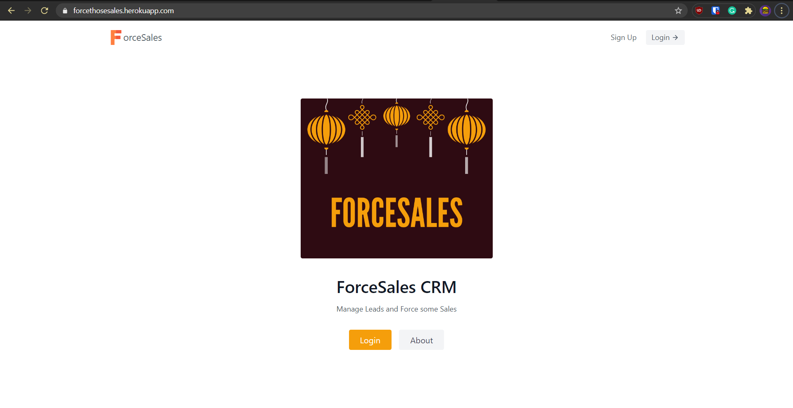

<h1 align="center">ForceSales</h1>
<div align="center">

  [](https://forcethosesales.herokuapp.com/)
  [](https://github.com/AnimeshRy/ForceSales/blob/master/LICENSE)
</div>


CRM Build with Django 3 and PostgreSQL 

ForceSales is a [Customer relationship management](https://www.zoho.com/crm/what-is-crm.html) software and is not a copy of any existing out there.

> *It does sound like one though*

Website - [https://forcethosesales.herokuapp.com/](https://forcethosesales.herokuapp.com/)




## Features
ForceSales have all the basic features implemented as you'd find in any other existing CRM.

- CRUD Leads, Agent & Categories
- Segment Leads into Categories
- Attach Agents to Leads
- Agents User Login and Manage Leads

## Backend 

ForceSales Uses Django 3 as the backend which manages everything - routes, auth, static files etc.

**DB** - The deployed project uses PostgreSQL as the primary database.

## Frontend 

ForceSales uses [Tailwind](https://tailwindcss.com/docs/) as the CSS frontend framework. The project uses cdn's instead of static npm package.

The project also utilizes these [tailwind blocks](https://tailblocks.cc/) as prepared frontend blocks.

## Pull Requests
The project is open to improvements and is accepting all useful contributions.

### To Contribute

- The project has two branches - [master](https://github.com/AnimeshRy/ForceSales/tree/master) and [develop](https://github.com/AnimeshRy/ForceSales/tree/develop).
- To contribute, use the develop branch and i'll see if I can moderate those changes to the master branch.
  
>Note - *The develop branch still uses SQLite3 as the main db*

## Clone 

You can clone the master branch but you'll need a DB setup and some `setting.py` changes, it's better to switch to the develop branch.

```bash
git clone https://github.com/AnimeshRy/ForceSales.git
cd ForceSales
git checkout develop
pip install -r requirements.txt

touch .env
# generate secret key
echo "SECRET_KEY=generated_secret_key" >> .env

python manage.py migrate 
python manage.py runserver
```

You can deploy this app yourself to Heroku to play with.

[](https://heroku.com/deploy)

